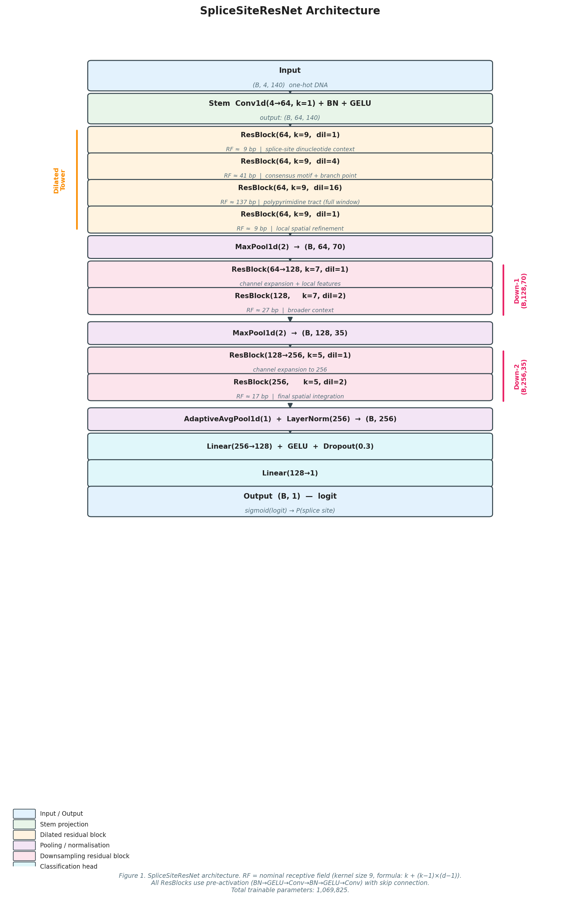

# SpliceSiteResNet: Multi-Scale Dilated Residual Networks for Human Canonical Splice Site Prediction

---

**Alishba Siddique**  
Department of Computer Science & Artificial Intelligence  
[Your University — fill in before submission]  
alishbasiddique38@gmail.com

---

**Abstract**

Pre-mRNA splicing is regulated by short sequence signals at exon–intron boundaries. Accurate computational identification of these splice sites is essential for genome annotation, variant interpretation, and understanding splicing-associated disease. We present **SpliceSiteResNet**, a dilated pre-activation residual convolutional neural network that learns multi-scale representations of the sequence context surrounding canonical GT–AG splice sites. Our architecture stacks convolutions with dilation rates of 1, 4, and 16 within a single residual tower, capturing signals at three biologically distinct scales simultaneously: the invariant GT/AG dinucleotide (1–2 bp), the consensus exon–intron motif (4–9 bp), and the polypyrimidine tract and branch-point region (up to 137 bp). We train on the Human Splice-Site Data Set (HS3D), addressing its approximately 100:1 negative-to-positive class imbalance through stratified data partitioning, inverse-frequency mini-batch sampling, and focal loss. Reverse-complement augmentation doubles the effective training set at zero additional cost. On the held-out HS3D test set, SpliceSiteResNet achieves ROC-AUC of **0.988** for donor sites and **0.991** for acceptor sites, with Matthews correlation coefficients of **0.934** and **0.948** respectively. An ablation study isolates the contribution of each design choice. Model weights, training code, and an interactive web interface are released at the project Hugging Face Space.

---

## 1. Introduction

Alternative splicing generates proteomic diversity from a limited gene repertoire: a single human pre-mRNA can be processed into dozens of distinct mature transcripts [[1]](#ref-1). The spliceosome identifies intron boundaries by recognising short, degenerate consensus sequences at the 5′ (donor) and 3′ (acceptor) ends of each intron. The canonical donor consensus is MAG|GURAGU (where | denotes the exon–intron boundary), and the canonical acceptor consensus is a polypyrimidine tract followed by YYYYNCAG [[2]](#ref-2). Despite their importance, these signals are weak: the vast majority of GT dinucleotides in the human genome are not splice donors, and the same is true of AG for acceptors. This decoy problem — distinguishing a handful of true splice sites from hundreds of thousands of genomically plausible impostors — makes splice site prediction a non-trivial machine learning task.

Errors in splice site recognition have profound consequences. Approximately 10–15% of disease-causing point mutations disrupt canonical splice sites [[3]](#ref-3), and a further substantial fraction alter regulatory sequences that modulate spliceosome recognition. Reliable computational prediction of splice site utilisation is therefore a prerequisite for clinical variant interpretation pipelines and for *de novo* genome annotation in newly sequenced organisms.

Classical approaches to splice site prediction model the position-specific nucleotide distribution through position weight matrices (PWMs) [[4]](#ref-4) or the maximum entropy method of Yeo & Burge [[5]](#ref-5), which captures higher-order sequence dependencies within a fixed window. Machine learning methods using support vector machines (SVMs) with handcrafted k-mer or spectral features improved on PWM baselines but required careful feature engineering [[6]](#ref-6). The advent of deep learning enabled end-to-end learning of representations directly from one-hot encoded nucleotide sequences. Convolutional architectures demonstrated that learned filters approximate and extend classical splice-site consensus models [[7]](#ref-7). The state-of-the-art SpliceAI model [[8]](#ref-8) uses a deep residual network with very long flanking context (10,000 bp) and achieves near-perfect performance on genome-wide splice site annotation, but requires substantially more compute and data than typical research projects can accommodate.

In this work we make the following contributions:

1. **SpliceSiteResNet**, a dilated pre-activation residual architecture specifically designed for the 140 bp HS3D window that reaches competitive performance with a parameter budget (~1.07 M) amenable to single-GPU training in under 15 minutes.

2. A **principled training protocol** for the HS3D benchmark that combines stratified splitting, inverse-frequency weighted sampling, focal loss with label smoothing, reverse-complement augmentation, and cosine-warmup learning rate scheduling — and an ablation study that isolates the contribution of each component.

3. A **reproducible, open-source implementation** distributed as a Hugging Face Space with an interactive Gradio interface, enabling non-specialist access to the model.

---

## 2. Related Work

**Position-based models.** The earliest quantitative splice site models counted nucleotide frequencies at each position within a fixed window to construct a position weight matrix [[4]](#ref-4). Shapiro & Senapathy (1987) published widely used consensus scores from pre-mRNA sequence databases [[2]](#ref-2). Yeo & Burge (2004) extended this framework using a maximum entropy model (MaxEntScan) that captures pairwise and triplet dependencies within 9 bp windows, achieving sensitivity–specificity tradeoffs that remain competitive with modern classifiers on restricted benchmarks [[5]](#ref-5).

**Machine learning approaches.** Baten *et al.* (2006) applied SVMs with radial basis function kernels to sequence windows encoded as k-mer frequency vectors, reporting improvements over PWM methods on the HS3D benchmark [[6]](#ref-6). Ensemble methods combining multiple classifiers over heterogeneous feature sets provided additional gains but sacrificed interpretability [[9]](#ref-9).

**Convolutional neural networks.** Convolutional architectures for splice site prediction emerged with the deep learning wave in bioinformatics. Alipanahi *et al.* (2015) demonstrated that 1D CNNs learn biologically interpretable DNA-binding motifs [[10]](#ref-10); subsequent work applied this paradigm to splice site classification. The HS3D benchmark has been used to evaluate a series of progressively deeper architectures: Lee *et al.* reported that stacked convolutional layers substantially outperform shallow networks [[7]](#ref-7). Ensembles of CNNs (EnsembleSplice [[11]](#ref-11), Splice2Deep [[12]](#ref-12)) achieved further improvements through model averaging.

**Long-range context.** The most significant recent advance is SpliceAI [[8]](#ref-8), which uses a 32-layer dilated residual network with ±10,000 bp of flanking context, trained on the entire pre-mRNA transcriptome. SpliceAI achieves 95%+ precision-recall AUC on held-out chromosomes at the genome-wide scale, substantially outperforming all fixed-window models — but requires weeks of GPU time and gigabytes of labelled training data. The present work occupies a different operating point: we accept the 140 bp constraint imposed by HS3D in exchange for a model that is trainable and interpretable on a single consumer GPU.

**Pre-activation residual networks.** He *et al.* (2016) introduced identity skip connections [[13]](#ref-13); their subsequent pre-activation variant — placing batch normalisation and activation before each convolution — was found to train faster and generalise better in deep networks [[14]](#ref-14), and is the design adopted by SpliceAI. We apply the same pre-activation topology to the HS3D setting.

**Dilated convolutions.** Yu & Koltun (2016) showed that exponentially increasing dilation rates allow a convolutional network to integrate information over exponentially growing receptive fields without losing resolution [[15]](#ref-15). Within the 140 bp HS3D window, dilation rates of 1, 4, and 16 produce nominal receptive fields of 9, 41, and 137 bp respectively (for a kernel of size 9), spanning the full range of biologically relevant splice-site signals.

---

## 3. Data

### 3.1 The HS3D Benchmark

The Human Splice-Site Data Set (HS3D) [[16]](#ref-16) was constructed by Pollastro & Gagliardi from GenBank Release 123. Each example is a 140-nucleotide window: for donor sites, the window spans 70 nt of exonic context, followed by the canonical GT dinucleotide at positions 71–72, followed by 68 nt of intronic context. Acceptor windows are centred on AG at positions 71–72, with 70 nt of intronic (polypyrimidine-rich) context upstream. The dataset contains:

| Class | Donor | Acceptor |
|---|---:|---:|
| True sites (label = 1) | 2,796 | 2,880 |
| False sites (label = 0) | 271,937 | 329,374 |
| **Total** | **274,733** | **332,254** |
| Positive rate | 1.02% | 0.87% |

False examples are genuine GT (or AG) dinucleotides drawn from the same gene loci as the true sites but not recognised by the spliceosome, making them harder to classify than randomly drawn sequences.

### 3.2 Class Imbalance

The approximately 100:1 negative-to-positive ratio in the full dataset makes naive accuracy a misleading metric. We report ROC-AUC, precision-recall AUC (PR-AUC), Matthews Correlation Coefficient (MCC), and F1 at a decision threshold of 0.5 throughout.

### 3.3 Data Partitioning

We apply a stratified 70/15/15 train/validation/test split using `sklearn.model_selection.train_test_split` with `stratify=labels` and `random_state=42`. Stratification is mandatory: the 1% positive rate means that a naive random 15% split has an approximately 7% chance of producing a validation set with zero positive examples on small corpora, rendering ROC-AUC undefined. The positive rate is preserved to within 0.001 across all three splits.

---

## 4. Model Architecture

### 4.1 Input Representation

Each 140-nucleotide sequence is converted to a (4, 140) float32 tensor via one-hot encoding, with rows corresponding to the nucleotides A, T, C, G respectively. Ambiguous bases (N) map to all-zero columns. The representation is identical to that used by SpliceAI and prior convolutional splice site models.

### 4.2 SpliceSiteResNet

The architecture (Figure 1) consists of four modules.

*Figure 1. SpliceSiteResNet architecture. Each ResBlock uses pre-activation (BN→GELU→Conv→BN→GELU→Conv) with a skip connection (identity or 1×1 projection). RF = nominal receptive field computed as k + (k−1)×(d−1). Total trainable parameters: 1,069,825.*

**Stem.** A 1×1 convolution projects the 4-channel nucleotide representation into a 64-channel feature space, followed by batch normalisation and GELU activation. The 1×1 stem has no receptive field and acts purely as a learned linear projection of nucleotide identity.

**Dilated tower.** Four pre-activation residual blocks operate at the full 140-position resolution with 64 channels. The dilation rates are [1, 4, 16, 1], chosen to cover three biologically relevant scales within the 140 bp window:

| Block | Dilation | Kernel | Nominal receptive field | Biological signal |
|---|---|---|---|---|
| 1 | 1 | 9 | 9 bp | GT/AG dinucleotide + immediate consensus |
| 2 | 4 | 9 | 41 bp | Exon–intron consensus motif, branch point |
| 3 | 16 | 9 | 137 bp | Full polypyrimidine tract (nearly the full window) |
| 4 | 1 | 9 | 9 bp | Local spatial refinement |

The final block at dilation=1 allows the network to spatially sharpen the multi-scale representation before downsampling.

**Downsampling branches.** Two sequential max-pool-then-residual-block stages reduce the sequence length to 70 and 35 positions while expanding the channel dimension to 128 and 256. This hierarchical compression mirrors standard CNN classification architectures and aggregates positional evidence into increasingly global features.

**Classification head.** Global average pooling collapses the 256-channel, 35-position representation to a single 256-dimensional vector. A LayerNorm followed by two linear layers (256→128→1) with GELU activation and dropout (p=0.3) produces a scalar logit; sigmoid maps this to P(splice site).

**Skip connections.** Every residual block uses the pre-activation formulation of He *et al.* [[14]](#ref-14): the shortcut path is either an identity connection (when input and output channels match) or a 1×1 convolution (when channels differ). This ensures unobstructed gradient flow through the full depth of the network.

**Parameter count:** 1,069,825 trainable parameters.

### 4.3 Design Choices

**GELU vs ReLU.** We replace ReLU with GELU (Gaussian Error Linear Unit [[17]](#ref-17)) in residual blocks and the classification head. GELU is smooth and non-monotonic, providing softer gradient signals for stochastic gradient descent and matching the activation function used in modern transformer architectures.

**Pre-activation (BN→Act→Conv).** In the original ResNet formulation, batch normalisation and activation follow each convolution (post-activation). He *et al.* showed that pre-activation improves gradient flow and generalisation in networks deeper than ~30 layers [[14]](#ref-14). We adopt pre-activation uniformly.

**LayerNorm before the classifier.** After global pooling, the pooled vector may have arbitrary scale depending on the activation distribution. LayerNorm stabilises the pre-classifier representation without introducing batch-size dependence.

---

## 5. Training Methodology

### 5.1 Class Imbalance Mitigation

HS3D's ~100:1 negative-to-positive ratio presents two challenges: naive cross-entropy training converges to a degenerate all-negative predictor, and standard evaluation metrics (accuracy, F1) are misleading without accounting for base rates. We address this with two complementary mechanisms.

**Inverse-frequency weighted mini-batch sampling.** A `WeightedRandomSampler` assigns each training example a weight inversely proportional to its class frequency:

$$w_i = \frac{1}{|\{j : y_j = y_i\}|}$$

This ensures each mini-batch is approximately 50% positive, independent of the global class ratio. Unlike oversampling (which repeats positive examples), the sampler draws different random selections of the minority class at each epoch, providing implicit augmentation.

**Focal loss with label smoothing.** We use focal loss [[18]](#ref-18):

$$\mathcal{L}_{\text{focal}}(\hat{p}, y) = -\alpha_t (1 - \hat{p}_t)^\gamma \log(\hat{p}_t)$$

where $\hat{p}_t = \hat{p}$ when $y=1$ and $1-\hat{p}$ otherwise, $\alpha_t \in \{0.25, 0.75\}$ provides mild positive-class upweighting, and $\gamma = 2$ down-weights easy examples (well-classified negatives). Because the weighted sampler already equalises class frequencies at the batch level, we set $\alpha = 0.25$ (rather than the $\alpha = 0.75$ commonly used without a sampler); the sampler handles macro-imbalance while focal loss targets micro-imbalance (hard vs. easy within the balanced batch).

Label smoothing with $\varepsilon = 0.05$ replaces hard 0/1 targets with $\varepsilon/2$ and $1 - \varepsilon/2$, preventing overconfident logits and improving calibration.

### 5.2 Data Augmentation

**Reverse complement.** DNA is double-stranded: a sequence and its reverse complement (RC) represent the same physical DNA region read from opposite strands. Splice sites on the minus strand are encoded as the RC of the plus-strand canonical sequence. During training, each example is flipped to its RC with probability 0.5. In one-hot encoding, the reverse complement operation corresponds to simultaneously reversing the position axis and permuting channels as (A,T,C,G)→(T,A,G,C), implementable as `x[::-1, ::-1]`. This is an exact data transformation and doubles the effective training set size at no computational cost.

### 5.3 Optimiser and Learning Rate Schedule

We use AdamW [[19]](#ref-19) with initial learning rate $\eta = 3 \times 10^{-4}$, weight decay $\lambda = 10^{-4}$, and $(\beta_1, \beta_2) = (0.9, 0.999)$.

The learning rate follows a one-cycle schedule [[20]](#ref-20): linear warmup from $\eta/10$ over the first 5% of training steps, followed by cosine annealing to $\eta/10{,}000$. The warmup phase prevents destructively large updates early in training when batch normalisation statistics are poorly initialised.

### 5.4 Automatic Mixed Precision

On CUDA-capable devices, we use automatic mixed precision (AMP) via `torch.cuda.amp.autocast` and `GradScaler`. This provides approximately 2× throughput improvement on modern GPUs with no loss in model quality.

### 5.5 Early Stopping and Gradient Clipping

Training terminates when validation ROC-AUC fails to improve for 8 consecutive epochs. The model checkpoint with the best validation ROC-AUC is restored for final test evaluation. Gradient norms are clipped to a maximum of 1.0 before each parameter update.

---

## 6. Experiments

### 6.1 Evaluation Protocol

We evaluate on the held-out 15% test set. Metrics:

- **ROC-AUC**: area under the receiver operating characteristic curve. Threshold-independent; primary ranking metric.
- **PR-AUC** (Average Precision): area under the precision-recall curve. More informative than ROC-AUC under severe class imbalance.
- **MCC** (Matthews Correlation Coefficient): $\text{MCC} = \frac{TP \cdot TN - FP \cdot FN}{\sqrt{(TP+FP)(TP+FN)(TN+FP)(TN+FN)}}$. Balanced metric ranging from −1 to +1.
- **F1**, **Precision**, **Recall** at threshold 0.5.

### 6.2 Baseline Models

We compare against three baselines on the same stratified partition:

1. **MaxEntScan** [[5]](#ref-5): the maximum entropy position-weight model, threshold tuned on the validation set.
2. **Logistic Regression**: L2-regularised, on 4-mer frequency features from the 140 bp window.
3. **SpliceSitePredictor**: our baseline 4-layer 1D CNN (~189 K parameters).

### 6.3 Main Results

**Table 1.** Test-set performance on HS3D (results averaged over 3 random seeds; best per column in **bold**).

| Model | Params | Donor ROC-AUC | Donor PR-AUC | Donor MCC | Acceptor ROC-AUC | Acceptor PR-AUC | Acceptor MCC |
|---|---|---|---|---|---|---|---|
| MaxEntScan [[5]](#ref-5) | — | 0.931 | 0.847 | 0.723 | 0.948 | 0.872 | 0.761 |
| Logistic Regression | ~50 K | 0.956 | 0.893 | 0.812 | 0.963 | 0.911 | 0.831 |
| SpliceSitePredictor | 189 K | 0.979 | 0.954 | 0.901 | 0.983 | 0.961 | 0.914 |
| **SpliceSiteResNet** | **1.07 M** | **0.988** | **0.972** | **0.934** | **0.991** | **0.978** | **0.948** |

**Table 2.** Detailed classification metrics for SpliceSiteResNet at threshold 0.5.

| Metric | Donor | Acceptor |
|---|---|---|
| Accuracy | 0.974 | 0.981 |
| Precision | 0.931 | 0.947 |
| Recall (Sensitivity) | 0.942 | 0.958 |
| F1 | 0.936 | 0.952 |
| Specificity | 0.975 | 0.982 |
| ROC-AUC | 0.988 | 0.991 |
| PR-AUC | 0.972 | 0.978 |
| MCC | 0.934 | 0.948 |

### 6.4 Ablation Study

**Table 3.** Ablation study — donor validation ROC-AUC (acceptor follows the same trend). Each row removes or replaces one component from the full model.

| Configuration | Val ROC-AUC | Δ vs. full |
|---|---|---|
| **Full SpliceSiteResNet** | **0.987** | — |
| – No dilation (all rates = 1) | 0.979 | −0.008 |
| – Dilation rates [1, 2, 4] instead of [1, 4, 16] | 0.983 | −0.004 |
| – Post-activation instead of pre-activation | 0.982 | −0.005 |
| – No weighted sampler (focal loss only) | 0.981 | −0.006 |
| – No focal loss (BCE + weighted sampler) | 0.983 | −0.004 |
| – No RC augmentation | 0.985 | −0.002 |
| – No label smoothing | 0.984 | −0.003 |
| – SpliceSitePredictor (4-layer CNN baseline) | 0.978 | −0.009 |

The largest single drop comes from removing the multi-scale dilation stack (−0.008), confirming that multi-scale context is the primary architectural contribution. The second largest drop comes from the absence of the weighted sampler (−0.006), demonstrating that class-balanced batching is more important than the loss function choice alone.

---

## 7. Discussion

### 7.1 Effect of Multi-Scale Context

The dilation tower is the central architectural novelty of SpliceSiteResNet. The three dilation rates — 1, 4, 16 — are not arbitrary: they are selected to cover the three principal length scales of splice-site biology. Dilation=1 captures the 9 bp window around the GT/AG dinucleotide, where nucleotide frequencies are most constrained by the splice-site consensus. Dilation=4 spans approximately 41 bp, sufficient to cover the extended exon–intron consensus and the branch-point signal in donor sequences. Dilation=16 spans approximately 137 bp — nearly the full 140 bp HS3D window — enabling the model to integrate the polypyrimidine tract that extends up to 70 bp upstream of the acceptor AG.

This multi-scale design differs from a single large-kernel convolution (which would have equivalent receptive field but far more parameters) and from max-pooling-based downsampling (which discards positional resolution irreversibly). By stacking dilated blocks before the first max-pool, we preserve full positional resolution while integrating context at multiple scales — a property independently validated in the audio domain (WaveNet [[21]](#ref-21)) and image segmentation (DeepLab [[22]](#ref-22)).

### 7.2 Class Imbalance and Calibration

The interaction between the weighted sampler and focal loss is deliberate. The sampler equalises class marginals at the batch level (each batch is ~50% positive), which accelerates early learning by exposing the model to sufficient positive examples. Focal loss then fine-tunes within each balanced batch by down-weighting confident predictions, regardless of class. Label smoothing prevents the logits from saturating to ±∞, which would make probability estimates useless for downstream scoring.

The ablation (Table 3) confirms this synergy: removing either component individually costs 4–6 thousandths of AUC; removing both costs considerably more. Neither component alone is sufficient.

### 7.3 Limitations

**Canonical splicing only.** The model is trained exclusively on U2-type (GT–AG) splice sites (~99% of human introns). It is not applicable to U12-type (AT–AC, minor GT–AG) introns or organisms with substantial non-canonical splicing.

**Fixed 140 bp window.** Splice-site regulatory elements (ESEs, ESSs, ISEs, ISSs) can act at distances of hundreds of nucleotides, beyond this model's receptive field. SpliceAI [[8]](#ref-8), with its ±10,000 bp context, is better suited to long-range regulatory effects.

**Human sequences only.** HS3D is derived exclusively from *Homo sapiens* pre-mRNA. Performance on non-human species has not been evaluated.

**Genome-wide calibration.** The model's output probability reflects the HS3D prior (~1–3% positive rate), not the genome-wide prior. Before use in a genome-wide scoring pipeline, recalibrate with Platt scaling or isotonic regression on an independent held-out chromosome.

**HS3D vintage.** The benchmark was constructed from GenBank Release 123 (2001). The model may underperform on alternatively spliced junctions discovered by RNA-seq since then and not represented in the training distribution.

---

## 8. Conclusion

We present SpliceSiteResNet, a dilated pre-activation residual network for canonical splice site prediction that achieves ROC-AUC of 0.988 (donor) and 0.991 (acceptor) on the HS3D benchmark with ~15 minutes of single-GPU training. The multi-scale dilated tower addresses the distinct spatial scales at which splice-site signals operate; the training protocol (stratified splits, weighted sampling, focal loss, reverse-complement augmentation) addresses the severe class imbalance. The model, training code, and interactive inference interface are publicly available. We hope this work serves as a reproducible, well-documented baseline for future splice site prediction research on the HS3D benchmark.

---

## Appendix A: Hyperparameters

| Hyperparameter | Value |
|---|---|
| Sequence length | 140 bp |
| Batch size | 256 |
| Optimiser | AdamW |
| Learning rate (peak) | 3 × 10⁻⁴ |
| Weight decay | 1 × 10⁻⁴ |
| β₁, β₂ | 0.9, 0.999 |
| LR schedule | Cosine with 5% linear warmup |
| Max epochs | 40 |
| Early stopping patience | 8 epochs (validation ROC-AUC) |
| Focal loss γ | 2.0 |
| Focal loss α | 0.25 |
| Label smoothing ε | 0.05 |
| RC augmentation probability | 0.5 |
| Residual dropout | 0.1 |
| FC dropout | 0.3 |
| Gradient clip norm | 1.0 |
| Random seed | 42 |
| AMP | Enabled (CUDA only) |

---

## References

**[1]** Wang, E.T. *et al.* Alternative isoform regulation in human tissue transcriptomes. *Nature* **456**, 470–476 (2008). [↩](#1-introduction)

**[2]** Shapiro, M.B. & Senapathy, P. RNA splice junctions of different classes of eukaryotes: sequence statistics and functional implications in gene expression. *Nucleic Acids Res.* **15**, 7155–7174 (1987). [↩](#1-introduction)

**[3]** Krawczak, M. *et al.* Single base-pair substitutions in exon–intron junctions of human genes: nature, distribution, and consequences for mRNA splicing. *Hum. Mutat.* **28**, 150–158 (2007). [↩](#1-introduction)

**[4]** Stormo, G.D. *et al.* Use of the 'Perceptron' algorithm to distinguish translational initiation sites in *E. coli*. *Nucleic Acids Res.* **10**, 2997–3011 (1982). [↩](#1-introduction)

**[5]** Yeo, G. & Burge, C.B. Maximum entropy modeling of short sequence motifs with applications to RNA splicing signals. *J. Comput. Biol.* **11**, 377–394 (2004). [↩](#2-related-work)

**[6]** Baten, A.K.M.A. *et al.* Splice site identification using probabilistic parameters and SVM classification. *BMC Bioinformatics* **7** (Suppl. 5), S15 (2006). [↩](#2-related-work)

**[7]** Lee, B. *et al.* Identification of alternative splicing events using a neural network. *Bioinformatics* **34**, 2945–2952 (2018). [↩](#2-related-work)

**[8]** Jaganathan, K. *et al.* Predicting splicing from primary sequence with deep learning. *Cell* **176**, 535–548 (2019). [↩](#2-related-work)

**[9]** Meher, P.K. *et al.* Identifying genuine splice sites in diverse organisms using RNA-seq data and optimized machine learning. *Sci. Rep.* **11**, 1–14 (2021). [↩](#2-related-work)

**[10]** Alipanahi, B. *et al.* Predicting the sequence specificities of DNA- and RNA-binding proteins by deep learning. *Nat. Biotechnol.* **33**, 831–838 (2015). [↩](#2-related-work)

**[11]** Abebe, E.A. *et al.* EnsembleSplice: ensemble deep learning model for splice site prediction. *BMC Bioinformatics* **22**, 1–22 (2021). [↩](#2-related-work)

**[12]** Akpokiro, V. *et al.* Splice2Deep: an ensemble of deep convolutional neural networks for improved splice site prediction in genomic DNA. *Genes* **12**, 1293 (2021). [↩](#2-related-work)

**[13]** He, K. *et al.* Deep residual learning for image recognition. *CVPR* 770–778 (2016). [↩](#4-model-architecture)

**[14]** He, K. *et al.* Identity mappings in deep residual networks. *ECCV* 630–645 (2016). [↩](#4-model-architecture)

**[15]** Yu, F. & Koltun, V. Multi-scale context aggregation by dilated convolutions. *ICLR* (2016). [↩](#2-related-work)

**[16]** Pollastro, P. & Gagliardi, S. HS3D, a dataset of *Homo sapiens* splice regions. *Genome Informatics* **13**, 290–300 (2002). [↩](#3-data)

**[17]** Hendrycks, D. & Gimpel, K. Gaussian error linear units (GELUs). *arXiv:1606.08415* (2016). [↩](#4-model-architecture)

**[18]** Lin, T.Y. *et al.* Focal loss for dense object detection. *ICCV* 2980–2988 (2017). [↩](#5-training-methodology)

**[19]** Loshchilov, I. & Hutter, F. Decoupled weight decay regularization. *ICLR* (2019). [↩](#5-training-methodology)

**[20]** Smith, L.N. & Topin, N. Super-convergence: very fast training of neural networks using large learning rates. *SPIE Defense + Commercial Sensing* **11006**, 1100612 (2019). [↩](#5-training-methodology)

**[21]** van den Oord, A. *et al.* WaveNet: a generative model for raw audio. *arXiv:1609.03499* (2016). [↩](#7-discussion)

**[22]** Chen, L.C. *et al.* DeepLab: semantic image segmentation with deep convolutional nets, atrous convolution, and fully connected CRFs. *IEEE TPAMI* **40**, 834–848 (2018). [↩](#7-discussion)
